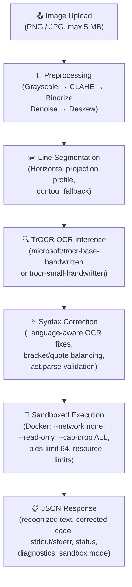

# 📝 Handwritten Code Evaluator

A full-stack web application that takes an uploaded image of handwritten code (Python, JavaScript, Java, or C++), recognizes the text using Microsoft's TrOCR model (via HuggingFace Transformers), segments multi-line code with OpenCV-based line detection, automatically corrects common OCR errors with language-aware heuristics, then executes the code in a hardened Docker sandbox with strict resource limits, and returns the results — all through a clean web interface.

---

## 🏗️ Architecture



### Flow Summary

1. **Image Upload** — User uploads a PNG/JPG image (max 5 MB) of handwritten code and selects the target language (Python, JavaScript, Java, or C++).
2. **Preprocessing** — The image is converted to grayscale, contrast-enhanced (CLAHE), binarized (adaptive threshold), denoised, and deskewed using OpenCV/Pillow.
3. **Line Segmentation** — The preprocessed image is analyzed to detect individual text lines using horizontal projection profiling, with contour-based fallback. Each line is cropped with its horizontal offset preserved for indentation reconstruction.
4. **TrOCR Inference** — Each detected line is fed to Microsoft's `trocr-base-handwritten` (or the lighter `trocr-small-handwritten`) model, and the results are assembled into multi-line code with adaptive indentation inference.
5. **Syntax Correction** — The raw OCR text is cleaned up with language-aware rules: for Python, indentation is normalized, common OCR character confusions are fixed, bracket/quote balancing is attempted, and the result is validated with `ast.parse()`. If parsing fails after retries, actionable diagnostics (line number, likely cause, suggestions) are returned. For other languages, only universal OCR fixes (curly quotes, numeric confusions) are applied.
6. **Sandboxed Execution** — The corrected code is executed inside a short-lived Docker container with full isolation: no network access, read-only filesystem, resource limits (CPU, memory, PIDs), dropped capabilities, and a non-privileged user. Falls back to subprocess-based execution when Docker is unavailable.
7. **JSON Response** — The API returns the recognized text, corrected code, execution output, status, sandbox mode, processing time, and any correction diagnostics.

---

## 🚀 Setup Instructions

### Prerequisites

- **Python 3.10+** (tested with 3.14)
- **pip**
- **Docker** (required for full container isolation; the app falls back to subprocess execution without it)
  - Install from [docker.com](https://docs.docker.com/get-docker/)
  - Ensure the Docker daemon is running before starting the app

> **Optional:** Set `HCE_OCR_MODEL=light` to use the smaller `trocr-small-handwritten` model (~330 MB instead of ~1.3 GB) for faster startup and lower memory usage, at a slight accuracy cost.

### Installation

```bash
# Clone the repository
git clone https://github.com/SiddharthSeng/Handwritten-Code-Evaluator.git
cd Handwritten-Code-Evaluator

# Install dependencies
pip install -r requirements.txt

# Build the Docker sandbox image (required for container isolation)
docker build -f Dockerfile.sandbox -t hce-sandbox:latest .

# (Optional) Pre-download the OCR model to avoid wait on first request
python scripts/download_model.py          # base model (~1.3 GB)
# python scripts/download_model.py --light  # or smaller model (~330 MB)

# Run the app
python app.py
```

The app will start on `http://localhost:5000`.

### GPU vs CPU

- **GPU (CUDA):** If you have an NVIDIA GPU with CUDA installed, TrOCR inference will automatically run on GPU. Expect ~0.5–1s per image.
- **CPU:** Without a GPU, inference runs on CPU. Expect ~2–5s per image. The app logs which device is being used on startup.

> **Note:** The TrOCR model checkpoint is downloaded automatically from HuggingFace on first run and cached locally. Set `HCE_OCR_MODEL=light` to download the smaller variant (~330 MB) instead of the default (~1.3 GB). The app logs download progress on startup.

### Environment Variables

| Variable | Default | Description |
|---|---|---|
| `HCE_OCR_MODEL` | `base` | Set to `light` to use the smaller `trocr-small-handwritten` model |
| `REQUIRE_DOCKER` | `false` | Set to `true` to refuse code execution when Docker is unavailable (instead of falling back to subprocess) |

---

## 📡 API Reference

### `POST /evaluate`

Upload an image of handwritten code for OCR recognition and execution.

**Request:**
```bash
curl -X POST http://localhost:5000/evaluate \
  -F "image=@handwritten_code.png" \
  -F "language=python"
```

**Form Fields:**

| Field | Type | Required | Default | Description |
|---|---|---|---|---|
| `image` | file | Yes | — | PNG or JPEG image of handwritten code (max 5 MB) |
| `language` | string | No | `python` | Target language: `python`, `javascript`, `java`, or `cpp` |

**Response (200 OK):**
```json
{
  "request_id": "a1b2c3d4-e5f6-7890-abcd-ef1234567890",
  "recognized_text": "print  (\"Hello World\")",
  "corrected_text": "print(\"Hello World\")",
  "auto_corrected": true,
  "stdout": "Hello World\n",
  "stderr": "",
  "execution_status": "success",
  "processing_time_seconds": 3.42,
  "language": "python",
  "sandbox_mode": "docker",
  "diagnostics": null
}
```

**Response Fields:**

| Field | Type | Description |
|---|---|---|
| `request_id` | string | Unique request identifier for logging |
| `recognized_text` | string | Raw OCR output from TrOCR |
| `corrected_text` | string | Syntax-corrected code |
| `auto_corrected` | boolean | `true` if code passed validation, `false` if corrections couldn't fully fix it |
| `stdout` | string | Standard output from code execution |
| `stderr` | string | Standard error from code execution |
| `execution_status` | string | `"success"`, `"error"`, or `"timeout"` |
| `processing_time_seconds` | float | Total processing time in seconds |
| `language` | string | Language used for execution |
| `sandbox_mode` | string | `"docker"` (full isolation) or `"subprocess"` (fallback) |
| `diagnostics` | array\|null | List of diagnostic objects when syntax correction fails (Python only), `null` otherwise |

**Diagnostic object format** (when `auto_corrected` is `false`):
```json
{
  "line": 3,
  "message": "SyntaxError: expected ':'",
  "suggestion": "A block-starting keyword (def, if, for, etc.) may be missing its trailing colon."
}
```

**Error Responses:**

| Status | Condition |
|---|---|
| `400` | No image uploaded, invalid file type, file exceeds 5 MB, or unsupported language |
| `500` | Internal server error (model loading failure, etc.) |

### `GET /health`

Health check endpoint.

**Response:**
```json
{
  "status": "healthy",
  "gpu_available": false,
  "device": "cpu",
  "model_loaded": true,
  "docker_available": true
}
```

---

## 🔒 Security Model

> **Honest disclaimer:** This is a portfolio/demo project. While the security model is now substantially hardened with Docker-based container isolation, it is not equivalent to a production multi-tenant code execution service. The improvements below represent meaningful defense-in-depth, but read the caveats.

### Protections In Place

| Protection | Implementation |
|---|---|
| **Container isolation** | Each code submission executes inside a short-lived Docker container, isolated from the host via Linux namespaces and cgroups. |
| **No `eval()`/`exec()`** | User code is NEVER executed via `eval()` or `exec()`. Execution goes through a subprocess inside the container. |
| **Network isolation** | Containers run with `--network none` — no network access of any kind (no HTTP, DNS, etc.). |
| **Read-only filesystem** | Container root filesystem is mounted read-only (`--read-only`). Only a size-limited tmpfs at `/tmp/sandbox` is writable. |
| **Resource limits** | CPU (`--cpus 0.5`), memory (`--memory 256m`, `512m` for Java), and PID count (`--pids-limit 64`) are enforced via cgroups. |
| **Capability dropping** | All Linux capabilities are dropped (`--cap-drop ALL`) and privilege escalation is blocked (`--security-opt no-new-privileges`). |
| **Non-privileged user** | Code runs as the `sandbox` user (UID 65534), not root. |
| **Hard timeout** | 10-second timeout for interpreted languages, 20-second timeout for compiled languages (Java/C++). Containers are killed if exceeded. |
| **Output size cap** | stdout/stderr are truncated to 10,000 characters to prevent resource exhaustion. |
| **Upload size limit** | 5 MB max upload size enforced by Flask. |

### Caveats

| Caveat | Details |
|---|---|
| **Docker daemon access** | The Flask app requires access to the Docker daemon (`/var/run/docker.sock`) to launch sandboxed containers. Docker daemon access is itself a meaningful host privilege — a compromised Flask process with daemon access could potentially escape isolation. For production use, consider rootless Docker or a dedicated execution worker with restricted daemon access. |
| **Fallback mode** | When Docker is unavailable, execution falls back to a bare subprocess (Python only) with no container isolation, no resource limits beyond a timeout, and no network restrictions. Set `REQUIRE_DOCKER=true` to disable this fallback. |
| **No syscall filtering** | seccomp and AppArmor profiles are not configured. Containers use Docker's default seccomp profile, which blocks many dangerous syscalls but is not a custom-tailored allowlist. |

### For Production Use

A production-grade code execution service would additionally require: custom seccomp/AppArmor profiles, rootless Docker or a dedicated execution daemon, rate limiting per user with authentication, audit logging, dedicated execution workers separate from the web server, and regular security updates to the sandbox image.

---

## ⚠️ Known Limitations

- **OCR accuracy depends on handwriting clarity.** TrOCR performs best on clear, reasonably neat handwriting. Very messy or stylized handwriting may produce poor results.
- **Indentation reconstruction is best-effort.** The line segmentation and adaptive indentation inference work well for clearly structured code, but handwriting scale variation, slanted lines, or inconsistent spacing may cause incorrect indentation. The system uses the smallest detected offset delta as the indent unit, which is a heuristic and won't be perfectly reliable on all real handwriting.
- **Syntax correction is heuristic-based (Python only).** The post-processing step uses pattern matching and OCR confusion rules. It provides actionable diagnostics when it can't fully fix the code, but complex syntax mistakes or unusual code patterns may not be auto-corrected. Non-Python languages receive only universal OCR fixes (curly quotes, numeric confusions).
- **Multi-language support requires Docker.** JavaScript, Java, and C++ execution is only available when Docker is installed. Without Docker, only Python execution is supported via subprocess fallback.
- **No auto-detection of programming language.** The user must select the target language manually. Auto-detection from OCR text is unreliable.

---

## 🛠️ Tech Stack

| Component | Technology |
|---|---|
| **Backend** | Python, Flask |
| **OCR Model** | Microsoft TrOCR (`trocr-base-handwritten` or `trocr-small-handwritten`) via HuggingFace Transformers |
| **Deep Learning** | PyTorch |
| **Image Processing** | Pillow, OpenCV, NumPy |
| **Line Segmentation** | OpenCV horizontal projection profiling with contour fallback |
| **Code Execution** | Docker SDK (primary) with subprocess fallback |
| **Container Isolation** | Docker with `--network none`, `--read-only`, `--cap-drop ALL`, resource limits |
| **Frontend** | HTML5, CSS3, Vanilla JavaScript |
| **API** | RESTful JSON API with CORS support |

---

## 👤 Author

**Siddharth Senguttuvan**
B.Tech Computer Science (AI & ML)
Hindustan Institute of Technology and Science (HITS)

---

## 📄 License

This project is open source and available for educational and portfolio purposes.
